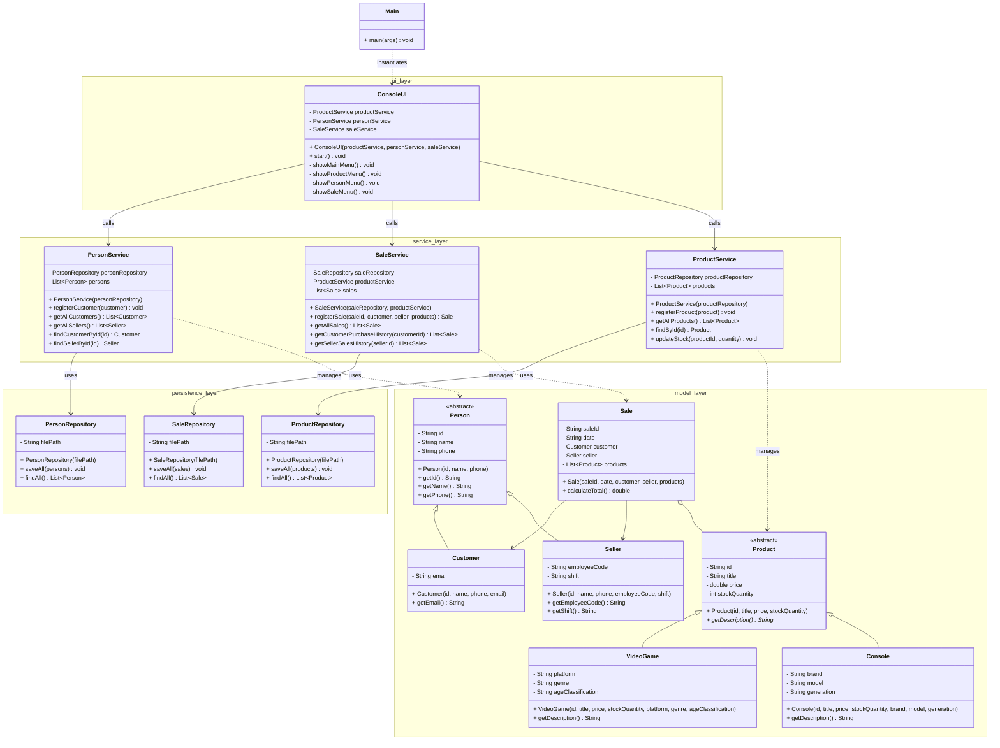

```mermaid
classDiagram
    direction TB

    namespace ui_layer {
        class ConsoleUI {
            - ProductService productService
            - PersonService personService
            - SaleService saleService
            + ConsoleUI(productService, personService, saleService)
            + start() void
            - showMainMenu() void
            - showProductMenu() void
            - showPersonMenu() void
            - showSaleMenu() void
        }
    }

    namespace service_layer {
        class PersonService {
            - PersonRepository personRepository
            - List~Person~ persons
            + PersonService(personRepository)
            + registerCustomer(customer) void
            + getAllCustomers() List~Customer~
            + getAllSellers() List~Seller~
            + findCustomerById(id) Customer
            + findSellerById(id) Seller
        }

        class SaleService {
            - SaleRepository saleRepository
            - ProductService productService
            - List~Sale~ sales
            + SaleService(saleRepository, productService)
            + registerSale(saleId, customer, seller, products) Sale
            + getAllSales() List~Sale~
            + getCustomerPurchaseHistory(customerId) List~Sale~
            + getSellerSalesHistory(sellerId) List~Sale~
        }

        class ProductService {
            - ProductRepository productRepository
            - List~Product~ products
            + ProductService(productRepository)
            + registerProduct(product) void
            + getAllProducts() List~Product~
            + findById(id) Product
            + updateStock(productId, quantity) void
        }
    }

    namespace persistence_layer {
        class PersonRepository {
            - String filePath
            + PersonRepository(filePath)
            + saveAll(persons) void
            + findAll() List~Person~
        }

        class SaleRepository {
            - String filePath
            + SaleRepository(filePath)
            + saveAll(sales) void
            + findAll() List~Sale~
        }

        class ProductRepository {
            - String filePath
            + ProductRepository(filePath)
            + saveAll(products) void
            + findAll() List~Product~
        }
    }

    namespace model_layer {
        class Person {
            <<abstract>>
            - String id
            - String name
            - String phone
            + Person(id, name, phone)
            + getId() String
            + getName() String
            + getPhone() String
        }

        class Customer {
            - String email
            + Customer(id, name, phone, email)
            + getEmail() String
        }

        class Seller {
            - String employeeCode
            - String shift
            + Seller(id, name, phone, employeeCode, shift)
            + getEmployeeCode() String
            + getShift() String
        }

        class Sale {
            - String saleId
            - String date
            - Customer customer
            - Seller seller
            - List~Product~ products
            + Sale(saleId, date, customer, seller, products)
            + calculateTotal() double
        }

        class Product {
            <<abstract>>
            - String id
            - String title
            - double price
            - int stockQuantity
            + Product(id, title, price, stockQuantity)
            + getDescription()* String
        }

        class VideoGame {
            - String platform
            - String genre
            - String ageClassification
            + VideoGame(id, title, price, stockQuantity, platform, genre, ageClassification)
            + getDescription() String
        }

        class Console {
            - String brand
            - String model
            - String generation
            + Console(id, title, price, stockQuantity, brand, model, generation)
            + getDescription() String
        }
    }

    class Main {
        + main(args) void
    }

    Main ..> ConsoleUI : instantiates
    ConsoleUI --> PersonService : calls
    ConsoleUI --> SaleService : calls
    ConsoleUI --> ProductService : calls

    PersonService --> PersonRepository : uses
    SaleService --> SaleRepository : uses
    ProductService --> ProductRepository : uses

    PersonService ..> Person : manages
    SaleService ..> Sale : manages
    ProductService ..> Product : manages

    Person <|-- Customer
    Person <|-- Seller
    Product <|-- VideoGame
    Product <|-- Console

    Sale --> Customer
    Sale --> Seller
    Sale o-- Product
```