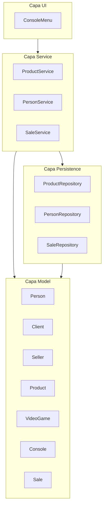

```mermaid
flowchart TD
    subgraph UI["Capa UI"]
        ConsoleMenu
    end

    subgraph SERVICE["Capa Service"]
        ProductService
        PersonService
        SaleService
    end

    subgraph PERSISTENCE["Capa Persistence"]
        ProductRepository
        PersonRepository
        SaleRepository
    end

    subgraph MODEL["Capa Model"]
        Person
        Client
        Seller
        Product
        VideoGame
        Console
        Sale
    end

    UI --> SERVICE
    SERVICE --> PERSISTENCE
    SERVICE --> MODEL
    PERSISTENCE --> MODEL
```