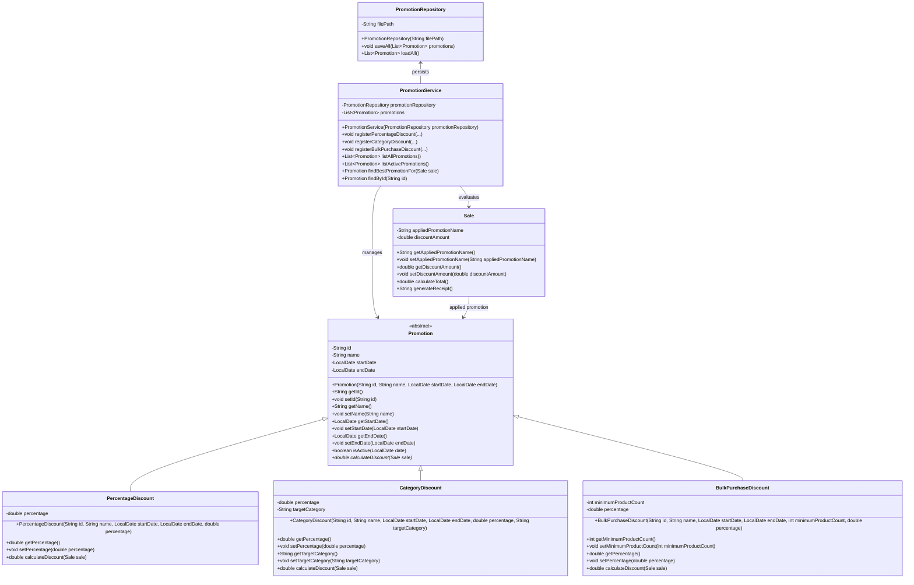

# Promotion Module Class Diagram

```mermaid
classDiagram

    class Promotion {
        <<abstract>>
        -String id
        -String name
        -LocalDate startDate
        -LocalDate endDate
        +Promotion(String id, String name, LocalDate startDate, LocalDate endDate)
        +String getId()
        +void setId(String id)
        +String getName()
        +void setName(String name)
        +LocalDate getStartDate()
        +void setStartDate(LocalDate startDate)
        +LocalDate getEndDate()
        +void setEndDate(LocalDate endDate)
        +boolean isActive(LocalDate date)
        +double calculateDiscount(Sale sale)*
    }

    class PercentageDiscount {
        -double percentage
        +PercentageDiscount(String id, String name, LocalDate startDate, LocalDate endDate, double percentage)
        +double getPercentage()
        +void setPercentage(double percentage)
        +double calculateDiscount(Sale sale)
    }

    class CategoryDiscount {
        -double percentage
        -String targetCategory
        +CategoryDiscount(String id, String name, LocalDate startDate, LocalDate endDate, double percentage, String targetCategory)
        +double getPercentage()
        +void setPercentage(double percentage)
        +String getTargetCategory()
        +void setTargetCategory(String targetCategory)
        +double calculateDiscount(Sale sale)
    }

    class BulkPurchaseDiscount {
        -int minimumProductCount
        -double percentage
        +BulkPurchaseDiscount(String id, String name, LocalDate startDate, LocalDate endDate, int minimumProductCount, double percentage)
        +int getMinimumProductCount()
        +void setMinimumProductCount(int minimumProductCount)
        +double getPercentage()
        +void setPercentage(double percentage)
        +double calculateDiscount(Sale sale)
    }

    class PromotionRepository {
        -String filePath
        +PromotionRepository(String filePath)
        +void saveAll(List~Promotion~ promotions)
        +List~Promotion~ loadAll()
    }

    class PromotionService {
        -PromotionRepository promotionRepository
        -List~Promotion~ promotions
        +PromotionService(PromotionRepository promotionRepository)
        +void registerPercentageDiscount(...)
        +void registerCategoryDiscount(...)
        +void registerBulkPurchaseDiscount(...)
        +List~Promotion~ listAllPromotions()
        +List~Promotion~ listActivePromotions()
        +Promotion findBestPromotionFor(Sale sale)
        +Promotion findById(String id)
    }

    class Sale {
        -String appliedPromotionName
        -double discountAmount
        +String getAppliedPromotionName()
        +void setAppliedPromotionName(String appliedPromotionName)
        +double getDiscountAmount()
        +void setDiscountAmount(double discountAmount)
        +double calculateTotal()
        +String generateReceipt()
    }

    Promotion <|-- PercentageDiscount
    Promotion <|-- CategoryDiscount
    Promotion <|-- BulkPurchaseDiscount

    PromotionRepository <-- PromotionService : persists
    PromotionService --> Promotion : manages
    PromotionService --> Sale : evaluates
    Sale --> Promotion : applied promotion
```
