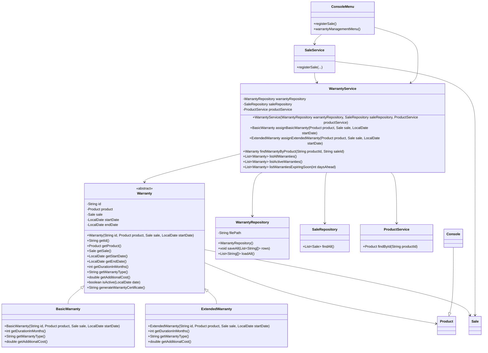

# Warranty Class Diagram

```mermaid
classDiagram
    class Warranty {
        <<abstract>>
        -String id
        -Product product
        -Sale sale
        -LocalDate startDate
        -LocalDate endDate
        +Warranty(String id, Product product, Sale sale, LocalDate startDate)
        +String getId()
        +Product getProduct()
        +Sale getSale()
        +LocalDate getStartDate()
        +LocalDate getEndDate()
        +int getDurationInMonths()
        +String getWarrantyType()
        +double getAdditionalCost()
        +boolean isActive(LocalDate date)
        +String generateWarrantyCertificate()
    }

    class BasicWarranty {
        +BasicWarranty(String id, Product product, Sale sale, LocalDate startDate)
        +int getDurationInMonths()
        +String getWarrantyType()
        +double getAdditionalCost()
    }

    class ExtendedWarranty {
        +ExtendedWarranty(String id, Product product, Sale sale, LocalDate startDate)
        +int getDurationInMonths()
        +String getWarrantyType()
        +double getAdditionalCost()
    }

    class WarrantyRepository {
        -String filePath
        +WarrantyRepository()
        +void saveAll(List~String[]~ rows)
        +List~String[]~ loadAll()
    }

    class WarrantyService {
        -WarrantyRepository warrantyRepository
        -SaleRepository saleRepository
        -ProductService productService
        +WarrantyService(WarrantyRepository warrantyRepository, SaleRepository saleRepository, ProductService productService)
        +BasicWarranty assignBasicWarranty(Product product, Sale sale, LocalDate startDate)
        +ExtendedWarranty assignExtendedWarranty(Product product, Sale sale, LocalDate startDate)
        +Warranty findWarrantyByProduct(String productId, String saleId)
        +List~Warranty~ listAllWarranties()
        +List~Warranty~ listActiveWarranties()
        +List~Warranty~ listWarrantiesExpiringSoon(int daysAhead)
    }

    class SaleRepository {
        +List~Sale~ findAll()
    }

    class ProductService {
        +Product findById(String productId)
    }

    class SaleService {
        +registerSale(...)
    }

    class ConsoleMenu {
        +registerSale()
        +warrantyManagementMenu()
    }

    class Product
    class Console
    class Sale

    Warranty <|-- BasicWarranty
    Warranty <|-- ExtendedWarranty

    Warranty --> Product
    Warranty --> Sale

    Console --|> Product

    WarrantyService --> WarrantyRepository
    WarrantyService --> SaleRepository
    WarrantyService --> ProductService
    WarrantyService --> Warranty

    SaleService --> WarrantyService
    SaleService --> Sale

    ConsoleMenu --> SaleService
    ConsoleMenu --> WarrantyService
```